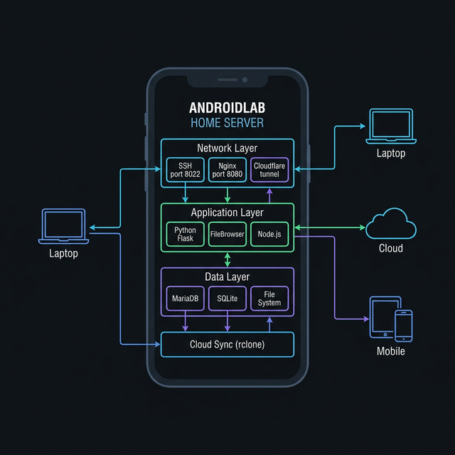

<p align="center">
  
</p>

<h1 align="center">📱 AndroidLab — Professional Home Server on Your Old Phone</h1>

<p align="center">
  <strong>The most complete guide to transforming any Android phone into a fully operational home server lab using Termux — covering SSH, Python, Node.js, databases, file management, web servers, Cloudflare tunnels, auto-boot startup, security hardening, monitoring, and more. Built for GitHub. Beginner-friendly. Production-ready.</strong>
</p>

---

<div align="center">


**⭐ Star this repo if it helped you!**

</div>

---

## 📋 Table of Contents

- [What Is This?](#-what-is-this)
- [Full Architecture Diagram](#-full-architecture-diagram)
- [Requirements](#-requirements)
- [Phase 1 — Termux Installation (The Right Way)](#-phase-1--termux-installation-the-right-way)
- [Phase 2 — Core System Setup](#-phase-2--core-system-setup)
- [Phase 3 — SSH Server (Remote Terminal Control)](#-phase-3--ssh-server-remote-terminal-control)
- [Phase 4 — Developer Tools Stack](#-phase-4--developer-tools-stack)
- [Phase 5 — Web Server with Nginx](#-phase-5--web-server-with-nginx)
- [Phase 6 — Database Servers (MariaDB + SQLite)](#-phase-6--database-servers-mariadb--sqlite)
- [Phase 7 — File Management Server](#-phase-7--file-management-server)
- [Phase 8 — Auto-Boot Startup with Termux:Boot](#-phase-8--auto-boot-startup-with-termuxboot)
- [Phase 9 — System Monitoring Dashboard](#-phase-9--system-monitoring-dashboard)
- [Phase 10 — Security Hardening](#-phase-10--security-hardening)
- [Phase 11 — Remote Internet Access (Cloudflare Tunnel)](#-phase-11--remote-internet-access-cloudflare-tunnel)
- [Phase 12 — Automation & Scheduled Tasks](#-phase-12--automation--scheduled-tasks)
- [Phase 13 — Docker Alternative (proot-distro)](#-phase-13--docker-alternative-proot-distro)
- [Quick Reference Cheatsheet](#-quick-reference-cheatsheet)
- [Troubleshooting Guide](#-troubleshooting-guide)
- [FAQ](#-faq)
- [Contributing](#-contributing)
- [License](#-license)

---

## 🧠 What Is This?

Most people let old phones collect dust in drawers. This project gives them a second life — turning them into real, functional Linux servers that run 24/7.

Using **Termux** (a Linux terminal emulator for Android), we install a complete server software stack:

- **SSH** so you can control the phone remotely from any computer
- **Nginx** to serve websites and act as a reverse proxy
- **MariaDB** for a full MySQL-compatible database
- **Python 3 + Node.js** for building APIs, bots, and automation scripts
- **FileBrowser** for a beautiful web-based file manager
- **rclone** to sync files to Google Drive, Dropbox, S3, and more
- **Cloudflare Tunnel** to make your server accessible from the internet — no port forwarding needed
- **Termux:Boot** so everything starts automatically when the phone powers on

Whether you want a personal cloud, a dev playground, a home automation hub, or just a way to learn Linux — this guide gets you there step by step.

<p align="center">
  
</p>

---

## 🏗 Full Architecture Diagram

```
╔══════════════════════════════════════════════════════════════════════╗
║                         ANDROID PHONE                               ║
║                                                                      ║
║  ┌────────────────────────────────────────────────────────────────┐  ║
║  │                    TERMUX (Linux Environment)                   │  ║
║  │                                                                  │  ║
║  │   NETWORK LAYER (Ports exposed on local Wi-Fi)                  │  ║
║  │   ┌──────────────┐  ┌──────────────┐  ┌──────────────────────┐ │  ║
║  │   │  OpenSSH     │  │   Nginx      │  │   Cloudflared        │ │  ║
║  │   │  Port: 8022  │  │  Port: 8080  │  │   (Tunnel Agent)     │ │  ║
║  │   │  (Terminal)  │  │  (Web/Proxy) │  │   yourdomain.com     │ │  ║
║  │   └──────────────┘  └──────────────┘  └──────────────────────┘ │  ║
║  │                            │                                     │  ║
║  │   APPLICATION LAYER        │                                     │  ║
║  │   ┌──────────────┐  ┌──────┴───────┐  ┌──────────────────────┐ │  ║
║  │   │  Python 3    │  │  FileBrowser │  │   Node.js            │ │  ║
║  │   │  Flask/FastAPI│  │  Port: 8081  │  │   Port: 3000         │ │  ║
║  │   │  Port: 5000  │  │  (File UI)   │  │   (JS Apps)          │ │  ║
║  │   └──────────────┘  └──────────────┘  └──────────────────────┘ │  ║
║  │                                                                  │  ║
║  │   DATA LAYER                                                     │  ║
║  │   ┌──────────────┐  ┌──────────────┐  ┌──────────────────────┐ │  ║
║  │   │  MariaDB     │  │   SQLite     │  │   File System        │ │  ║
║  │   │  Port: 3306  │  │  (embedded)  │  │   ~/server/          │ │  ║
║  │   └──────────────┘  └──────────────┘  └──────────────────────┘ │  ║
║  │                                                                  │  ║
║  │   CLOUD SYNC LAYER                                               │  ║
║  │   ┌──────────────────────────────────────────────────────────┐  │  ║
║  │   │  rclone → Google Drive / Dropbox / S3 / OneDrive / etc.  │  │  ║
║  │   └──────────────────────────────────────────────────────────┘  │  ║
║  │                                                                  │  ║
║  │   BOOT / PROCESS LAYER                                           │  ║
║  │   ┌──────────────────────────────────────────────────────────┐  │  ║
║  │   │  Termux:Boot → ~/.termux/boot/start-server.sh            │  │  ║
║  │   │  Runs automatically on every phone reboot                │  │  ║
║  │   └──────────────────────────────────────────────────────────┘  │  ║
║  └────────────────────────────────────────────────────────────────┘  ║
╚══════════════════════════════════════════════════════════════════════╝
                              │
          ┌───────────────────┼───────────────────┐
          │                   │                   │
   Local Network        Internet               Mobile
   ┌─────────────┐  ┌──────────────────┐  ┌──────────────┐
   │ Your Laptop │  │ Cloudflare Tunnel│  │  Your Phone  │
   │ ssh -p 8022 │  │ yourdomain.com   │  │  (SSH app)   │
   │ browser     │  │ files.domain.com │  │  Termius etc │
   └─────────────┘  └──────────────────┘  └──────────────┘
```

### Port Map

| Port | Service | Purpose |
|------|---------|---------|
| 8022 | OpenSSH | Remote terminal/control |
| 8080 | Nginx | Web server, reverse proxy |
| 8081 | FileBrowser | Web file manager UI |
| 5000 | Python Flask | System API, custom apps |
| 3000 | Node.js | JavaScript web apps |
| 3306 | MariaDB | MySQL database |

---

## ✅ Requirements

### Phone / Tablet (The Server)

| Spec | Minimum | Recommended |
|------|---------|-------------|
| Android Version | 5.0 (Lollipop) | 8.0+ (Oreo) |
| RAM | 2 GB | 4 GB+ |
| Storage | 8 GB free | 32 GB+ |
| Battery | Any | Keep plugged in |
| CPU | Any ARM | ARM64 (64-bit) |

> **Tip:** 64-bit phones (ARM64) have access to more packages and better performance. Most phones after 2017 are 64-bit.

### Control Device (Your Laptop/PC)

You need an SSH client to connect to your phone server:

| OS | Recommended SSH Client | Notes |
|----|----------------------|-------|
| Linux | Built-in terminal | `ssh` already installed |
| macOS | Built-in terminal | `ssh` already installed |
| Windows | Windows Terminal | Enable OpenSSH in Settings |
| Windows (alt) | PuTTY | Download from putty.org |
| Android | Termius | Best mobile SSH app |
| iOS | Termius | Best mobile SSH app |

### Network
- Both devices on the same Wi-Fi for local access
- A free Cloudflare account for internet access (optional)

---

## 📦 Phase 1 — Termux Installation (The Right Way)

> ⚠️ **CRITICAL WARNING:** The Google Play Store version of Termux is **outdated, unmaintained, and broken**. Many packages will fail to install. Always use **F-Droid**.

### Step 1.1 — Install F-Droid (App Store)

F-Droid is a free, open-source Android app store. It hosts the correct version of Termux.

1. On your phone, open a browser and go to: **https://f-droid.org**
2. Tap the big **"Download F-Droid"** button
3. Open the downloaded `.apk` file
4. You'll get a warning about installing from unknown sources. Here's how to allow it:

   **Android 8.0+:**
   - Go to **Settings → Apps → Special App Access → Install Unknown Apps**
   - Find your browser app and enable "Allow from this source"

   **Android 7 and below:**
   - Go to **Settings → Security**
   - Enable **"Unknown Sources"**

5. Install F-Droid, then open it
6. Wait for it to update its repository (this takes a minute)

### Step 1.2 — Install Termux from F-Droid

1. In F-Droid, tap the search icon
2. Search for **"Termux"**
3. Tap **Termux** by Fredrik Fornwall
4. Tap **Install** and wait for it to download

### Step 1.3 — Install Termux:Boot from F-Droid

This companion app allows scripts to run automatically when your phone starts. **You need this for Phase 8.**

1. Still in F-Droid, search for **"Termux:Boot"**
2. Install **Termux:Boot** by Fredrik Fornwall
3. **Open Termux:Boot at least once** — just launch it and close it. This registers it with Android so it gets boot permissions.

### Step 1.4 — First Launch of Termux

Open Termux. You'll see a black terminal screen. It will automatically download some base files. Wait for it to finish.

You should see a `$` prompt like:
```
Welcome to Termux!
~ $
```

### Step 1.5 — Grant Storage Permission

This gives Termux access to your phone's internal storage so you can manage files in your `Downloads`, `Documents` etc. folders:

```bash
termux-setup-storage
```

A permission dialog will pop up. Tap **Allow**.

After this, your phone's storage is accessible at `~/storage/`:
```bash
ls ~/storage/
# shared/  downloads/  dcim/  pictures/  music/  movies/
```

### Step 1.6 — Keep Termux Running (Important!)

Android aggressively kills background apps to save battery. You need to tell it not to kill Termux:

1. Open **Settings → Battery / Battery Optimization**
2. Find **Termux** in the list
3. Set it to **"Don't optimize"** or **"Unrestricted"**
4. Do the same for **Termux:Boot**

On some phones (Samsung, Xiaomi, Huawei), you may also need to:
- Lock Termux in the Recent Apps screen
- Disable "Auto-start management" restrictions
- Add Termux to the "protected apps" list

---

## ⚙️ Phase 2 — Core System Setup

> 💡 **Quick Start:** You can run our automated setup script instead of doing this manually:
> ```bash
> bash <(curl -fsSL https://raw.githubusercontent.com/yourusername/androidlab/main/scripts/setup.sh)
> ```

### Step 2.1 — Update Package Manager

The very first thing to do is update all packages. This ensures you have the latest versions and no broken dependencies:

```bash
pkg update -y && pkg upgrade -y
```

> This will ask you some questions during upgrade (like keeping old config files). Just press **Enter** to accept defaults.

If it asks: `:: Proceed with installation? [Y/n]` → press **Y** then Enter.

This may take **5–15 minutes** on first run depending on your internet speed.

### Step 2.2 — Install All Essential Core Tools

This one command installs everything you need as a foundation:

```bash
pkg install -y \
  curl \
  wget \
  git \
  vim \
  nano \
  htop \
  tree \
  zip \
  unzip \
  tar \
  grep \
  sed \
  gawk \
  coreutils \
  findutils \
  diffutils \
  procps \
  net-tools \
  iproute2 \
  nmap \
  tmux \
  screen \
  proot \
  proot-distro \
  openssh \
  openssl \
  ca-certificates \
  termux-tools \
  termux-api
```

**What each tool does:**

| Tool | Purpose |
|------|---------|
| `curl` / `wget` | Download files from the internet |
| `git` | Version control |
| `vim` / `nano` | Text editors |
| `htop` | Live CPU/RAM monitor |
| `tree` | Show directory structure |
| `zip/unzip/tar` | Compress and extract archives |
| `grep/sed/awk` | Text processing |
| `procps` | Process management (`ps`, `kill`) |
| `net-tools` | Network commands (`ifconfig`) |
| `iproute2` | Modern network commands (`ip`, `ss`) |
| `nmap` | Network scanner |
| `tmux` / `screen` | Terminal multiplexer (multiple sessions) |
| `proot` | Fake root access in Termux |
| `openssh` | SSH client and server |
| `openssl` | Cryptography toolkit |
| `termux-tools` | Termux utility scripts |
| `termux-api` | Access Android phone APIs from terminal |

### Step 2.3 — Learn tmux (Recommended!)

`tmux` lets you run multiple terminal sessions and keeps them alive even if you disconnect. Think of it as a window manager for your terminal.

```bash
# Start a new tmux session named "server"
tmux new -s server

# Inside tmux, create a new window: Ctrl+B then C
# Switch windows: Ctrl+B then 0, 1, 2...
# Split screen horizontally: Ctrl+B then "
# Split screen vertically: Ctrl+B then %
# Detach (leave session running): Ctrl+B then D

# Reattach to a session later
tmux attach -t server

# List all sessions
tmux ls
```

> **Pro tip:** Run your server inside a tmux session. If Termux crashes or you close the app, your services keep running when you reattach.

### Step 2.4 — Set Up Professional Directory Structure

```bash
# Create the complete server directory layout
mkdir -p ~/server/{www,scripts,logs,backups,config,databases,uploads,ssl,cron}
mkdir -p ~/.ssh
mkdir -p ~/.termux/boot
mkdir -p ~/mnt/{gdrive,dropbox,s3}

# Verify the structure
tree ~/server
```

You should see:
```
/data/data/com.termux/files/home/server
├── backups/        # Automated backup files
├── config/         # Service configuration files
├── cron/           # Scheduled task scripts
├── databases/      # Database dump files
├── logs/           # All service log files
├── scripts/        # Your automation scripts
├── ssl/            # SSL certificates
├── uploads/        # File uploads (FileBrowser root)
└── www/            # Web server root (your websites)
```

### Step 2.5 — Configure Your Shell Environment

This sets up aliases, environment variables, and a nice login message:

```bash
cat >> ~/.bashrc << 'EOF'

# ============================================================
#         AndroidLab Home Server — Shell Configuration
# ============================================================

# Environment
export EDITOR=nano
export SERVER_HOME="$HOME/server"
export LOGS="$SERVER_HOME/logs"
export WWW="$SERVER_HOME/www"
export SCRIPTS="$SERVER_HOME/scripts"
export PATH="$HOME/server/scripts:$PATH"

# ── Navigation Aliases ───────────────────────────────────────
alias ll='ls -alFh --color=auto'
alias la='ls -Ah --color=auto'
alias l='ls -CFh --color=auto'
alias ..='cd ..'
alias ...='cd ../..'
alias ....='cd ../../..'
alias ~='cd ~'
alias server-dir='cd ~/server'

# ── Network Aliases ──────────────────────────────────────────
alias myip='ip route get 1.1.1.1 | grep -oP "src \K\S+"'
alias myip-public='curl -s ifconfig.me'
alias ports='ss -tulnp'
alias ping8='ping 8.8.8.8 -c 4'

# ── Service Aliases ──────────────────────────────────────────
alias server='bash ~/server/scripts/server-ctl.sh'
alias start-ssh='pkill sshd 2>/dev/null; sshd && echo SSH started'
alias start-nginx='pkill nginx 2>/dev/null; nginx && echo Nginx started'
alias stop-ssh='pkill sshd && echo SSH stopped'
alias stop-nginx='pkill nginx && echo Nginx stopped'

# ── Log Aliases ──────────────────────────────────────────────
alias logs='ls ~/server/logs/'
alias boot-log='cat ~/server/logs/boot.log'
alias nginx-log='tail -f ~/server/logs/nginx-access.log'
alias nginx-err='tail -f ~/server/logs/nginx-error.log'
alias server-log='tail -f ~/server/logs/server.log'

# ── System Info Aliases ──────────────────────────────────────
alias ram='free -mh'
alias disk='df -h ~'
alias cpu='top -bn1 | grep "Cpu(s)"'
alias temp='cat /sys/class/thermal/thermal_zone*/temp 2>/dev/null | awk "{print \$1/1000\"°C\"}" | head -3'
alias sysinfo='echo "=CPU: $(nproc) cores" && free -mh && df -h ~'
alias running='ps aux | grep -E "sshd|nginx|mysqld|python|node|filebrowser" | grep -v grep'

# ── Git Aliases ──────────────────────────────────────────────
alias gs='git status'
alias ga='git add .'
alias gc='git commit -m'
alias gp='git push'
alias gl='git log --oneline -10'

# ── Safety Aliases ───────────────────────────────────────────
alias rm='rm -i'
alias cp='cp -i'
alias mv='mv -i'

# ── Login Banner ─────────────────────────────────────────────
function show_banner() {
  LOCAL_IP=$(ip route get 1.1.1.1 2>/dev/null | grep -oP 'src \K\S+' || echo 'Not connected')
  RAM_FREE=$(free -m | awk '/Mem:/{print $7}')
  DISK_FREE=$(df -h $HOME | awk 'NR==2{print $4}')
  UPTIME=$(uptime -p 2>/dev/null || uptime)

  echo ""
  echo "  ╔══════════════════════════════════╗"
  echo "  ║    📱 AndroidLab Home Server     ║"
  echo "  ╠══════════════════════════════════╣"
  printf "  ║  IP      : %-22s║\n" "$LOCAL_IP"
  printf "  ║  RAM Free: %-19s MB ║\n" "$RAM_FREE"
  printf "  ║  Disk Free: %-20s║\n" "$DISK_FREE"
  echo "  ╚══════════════════════════════════╝"
  echo ""
}

show_banner

EOF

# Apply the changes immediately
source ~/.bashrc
```

### Step 2.6 — Test Your Environment

```bash
# Test all your aliases work
myip          # Should show your local IP like 192.168.x.x
ram           # Should show memory info
disk          # Should show disk info
ll ~          # Should list home directory nicely
```

---

## 🔐 Phase 3 — SSH Server (Remote Terminal Control)

SSH (Secure Shell) is the most important service on your server. It lets you type commands on your phone from your laptop, as if you're physically sitting in front of it.

### How SSH Works (Quick Overview)

```
YOUR LAPTOP                          YOUR PHONE SERVER
┌──────────────┐                     ┌──────────────────┐
│  SSH Client  │ ──── encrypted ───► │  SSH Server      │
│  (terminal)  │       tunnel        │  (sshd :8022)    │
│              │ ◄─── response ───── │                  │
└──────────────┘                     └──────────────────┘
```

### Step 3.1 — Understand Termux SSH Paths

In Termux, the SSH server config is not in `/etc/ssh` like a normal Linux system. It's at:

```bash
# Config file location in Termux
$PREFIX/etc/ssh/sshd_config
# Which expands to:
/data/data/com.termux/files/usr/etc/ssh/sshd_config

# Host keys location
$PREFIX/etc/ssh/
```

### Step 3.2 — Generate SSH Host Keys

The server needs its own identity keys. Generate them:

```bash
# Generate all key types for maximum compatibility
ssh-keygen -A

# Verify keys were created
ls -la $PREFIX/etc/ssh/ssh_host_*
```

You should see:
```
ssh_host_dsa_key
ssh_host_ecdsa_key
ssh_host_ed25519_key
ssh_host_rsa_key
```

### Step 3.3 — Configure the SSH Server

We provide a ready-made config in this repo. Copy it:

```bash
cp config/sshd_config $PREFIX/etc/ssh/sshd_config
```

Or create it manually:

```bash
cat > $PREFIX/etc/ssh/sshd_config << 'EOF'
# ============================================================
#         AndroidLab — OpenSSH Server Configuration
# ============================================================

# Network
Port 8022
ListenAddress 0.0.0.0
AddressFamily any

# Authentication Methods
PermitRootLogin no
PasswordAuthentication yes
PubkeyAuthentication yes
AuthorizedKeysFile .ssh/authorized_keys .ssh/authorized_keys2
ChallengeResponseAuthentication no
KerberosAuthentication no
GSSAPIAuthentication no

# Security Limits
MaxAuthTries 3
MaxSessions 10
LoginGraceTime 30
ClientAliveInterval 60
ClientAliveCountMax 5

# Features
X11Forwarding no
AllowTcpForwarding yes
GatewayPorts no
PermitTunnel no
AllowAgentForwarding yes

# SFTP (file transfer via SSH)
Subsystem sftp /data/data/com.termux/files/usr/libexec/sftp-server

# Logging
LogLevel VERBOSE

# Banner (shown before login)
Banner /data/data/com.termux/files/home/server/config/ssh-banner.txt
EOF

echo "SSH config written successfully"
```

### Step 3.4 — Create SSH Login Banner (Optional)

```bash
cp config/ssh-banner.txt ~/server/config/ssh-banner.txt
```

### Step 3.5 — Set Your Login Password

```bash
# Set a password (you'll type this when SSH-ing in)
passwd

# Enter a STRONG password — at least 12 characters
# Mix uppercase, lowercase, numbers, and symbols
# Example: S3rv3r@Home2024!
# You won't see the password as you type — that's normal
```

> **Remember this password!** Without it, you won't be able to SSH in.

### Step 3.6 — Start the SSH Server

```bash
# Start sshd (SSH daemon)
sshd

# Confirm it's running
ps aux | grep sshd | grep -v grep
# You should see something like: sshd: /data/data/com.termux/files/usr/sbin/sshd

# Confirm it's listening on port 8022
ss -tulnp | grep 8022
# Should show: tcp  LISTEN  0  128  0.0.0.0:8022  ...

echo "SSH Server is running!"
echo "Phone IP Address: $(myip)"
echo "Connect with: ssh -p 8022 $(myip)"
```

### Step 3.7 — Connect From Your Laptop

Open a terminal on your laptop and run:

```bash
# Replace 192.168.1.100 with your actual phone IP
ssh -p 8022 192.168.1.100
```

You'll see:
```
The authenticity of host '[192.168.1.100]:8022' can't be established.
ED25519 key fingerprint is SHA256:xxxxx...
Are you sure you want to continue connecting (yes/no/[fingerprint])?
```

Type `yes` and press Enter. Then enter your password.

**You should now see a Termux prompt from your laptop!**

### Step 3.8 — Set Up SSH Key Authentication (Strongly Recommended)

Password authentication is convenient but less secure. SSH keys are better.

**On your LAPTOP, generate a key pair:**

```bash
# This creates a private key (keep secret!) and public key (share freely)
ssh-keygen -t ed25519 -C "androidlab-access" -f ~/.ssh/androidlab_key

# You'll be asked for a passphrase — add one for extra security, or press Enter to skip
```

This creates two files:
- `~/.ssh/androidlab_key` — private key (NEVER share this)
- `~/.ssh/androidlab_key.pub` — public key (this goes on the server)

**Copy your public key to the phone:**

```bash
# Method 1: Automated (easiest)
ssh-copy-id -i ~/.ssh/androidlab_key.pub -p 8022 192.168.1.100

# Method 2: Manual (if above doesn't work)
cat ~/.ssh/androidlab_key.pub
# Copy the output, then on your phone:
# mkdir -p ~/.ssh && nano ~/.ssh/authorized_keys
# Paste the key, save with Ctrl+X → Y → Enter
```

**Configure your laptop to use the key automatically:**

```bash
# On your LAPTOP, add this to ~/.ssh/config
cat >> ~/.ssh/config << 'EOF'

Host androidlab
    HostName 192.168.1.100
    Port 8022
    User u0_a123
    IdentityFile ~/.ssh/androidlab_key
    ServerAliveInterval 60
    ServerAliveCountMax 3
EOF

chmod 600 ~/.ssh/config
```

Now you can connect with just:
```bash
ssh androidlab
```

### Step 3.9 — SFTP (File Transfer via SSH)

SFTP lets you transfer files between your laptop and phone server. It works over the same SSH connection.

```bash
# From your laptop — connect to phone via SFTP
sftp -P 8022 192.168.1.100

# SFTP commands:
# put localfile.txt          → Upload file TO phone
# get remotefile.txt         → Download file FROM phone
# ls                         → List files on phone
# lls                        → List files on laptop
# cd /path/                  → Change directory on phone
# lcd /path/                 → Change directory on laptop
# mkdir new-folder           → Create folder on phone
# bye                        → Exit SFTP

# Or use it non-interactively:
sftp -P 8022 192.168.1.100:/home/path/file.txt ./local-copy.txt
```

### Step 3.10 — Disable Password Auth (After Keys Work)

Once you've confirmed key authentication works:

```bash
# On your phone, edit SSH config
nano $PREFIX/etc/ssh/sshd_config

# Change this line:
#   PasswordAuthentication yes
# To:
#   PasswordAuthentication no

# Restart SSH to apply
pkill sshd && sleep 1 && sshd
echo "Password authentication disabled. Keys only!"
```

---

## 🛠 Phase 4 — Developer Tools Stack

### Step 4.1 — Python 3 (Full Setup)

Python is the most versatile tool on your server — use it for APIs, automation, data processing, bots, and more.

```bash
# Install Python 3
pkg install -y python python-pip

# Verify
python --version     # Should show Python 3.x.x
pip --version        # Should show pip x.x.x

# Upgrade pip itself
pip install --upgrade pip setuptools wheel
```

**Install essential Python packages:**

```bash
# Web frameworks
pip install flask fastapi uvicorn[standard] gunicorn

# HTTP clients
pip install requests httpx aiohttp

# Data & utilities
pip install psutil schedule python-dotenv pyyaml toml

# Database connectors
pip install pymysql mysqlclient sqlite3 sqlalchemy

# SSH & networking from Python
pip install paramiko fabric

# Beautiful terminal output
pip install rich click colorama

# Security
pip install cryptography bcrypt passlib

# Background tasks
pip install celery redis rq apscheduler

# Data science (optional)
pip install numpy pandas

echo "All Python packages installed!"
pip list | wc -l  # Show count of installed packages
```

**Test Python works:**

```bash
python3 << 'EOF'
import flask, requests, psutil, yaml, rich
from rich.console import Console
console = Console()
console.print("[bold green]Python environment is working![/bold green]")
console.print(f"CPU: {psutil.cpu_percent()}%")
console.print(f"RAM: {psutil.virtual_memory().percent}% used")
EOF
```

### Step 4.2 — Node.js & npm (Full Setup)

```bash
# Install Node.js LTS
pkg install -y nodejs

# Verify
node --version    # Should show v18+ or v20+
npm --version     # Should show 9+

# Install global tools
npm install -g \
  pm2 \
  nodemon \
  http-server \
  express-generator \
  typescript \
  ts-node \
  eslint \
  prettier \
  yarn \
  pnpm

echo "Node.js environment ready!"
```

**What each global package does:**

| Package | Purpose |
|---------|---------|
| `pm2` | Process manager — keeps Node apps running forever |
| `nodemon` | Auto-restart during development |
| `http-server` | Quick static file server |
| `typescript` | TypeScript compiler |
| `ts-node` | Run TypeScript directly |
| `yarn` / `pnpm` | Alternative package managers |

**Using PM2 to keep Node apps alive:**

```bash
# Start a Node.js app with PM2 (stays running after terminal closes)
pm2 start app.js --name "my-app"

# Start with specific options
pm2 start app.js --name "api" --watch --max-memory-restart 200M

# View running apps
pm2 list

# View logs
pm2 logs my-app

# Restart an app
pm2 restart my-app

# Save process list (restores on reboot if configured)
pm2 save

# Auto-start on Termux restart (add to boot script)
pm2 resurrect
```

### Step 4.3 — Git (Full Configuration)

```bash
# Basic identity
git config --global user.name "Your Name"
git config --global user.email "your@email.com"

# Preferences
git config --global init.defaultBranch main
git config --global core.editor nano
git config --global pull.rebase false
git config --global color.ui auto
git config --global core.autocrlf input

# Useful aliases
git config --global alias.st status
git config --global alias.co checkout
git config --global alias.br branch
git config --global alias.lg "log --oneline --graph --decorate --all"
git config --global alias.undo "reset HEAD~1 --mixed"
git config --global alias.save "stash push -m"

# Verify
git config --list | head -20
git --version
```

**Set up GitHub SSH authentication:**

```bash
# Generate a key for GitHub access
ssh-keygen -t ed25519 -C "your@email.com" -f ~/.ssh/github_key -N ""

# Display the public key
cat ~/.ssh/github_key.pub
# Copy this output and add it to GitHub:
# → github.com → Settings → SSH Keys → New SSH Key

# Configure SSH to use this key for GitHub
cat >> ~/.ssh/config << 'EOF'

Host github.com
    HostName github.com
    User git
    IdentityFile ~/.ssh/github_key
    AddKeysToAgent yes
EOF

# Test GitHub connection
ssh -T git@github.com
# Should show: Hi username! You've successfully authenticated...
```

### Step 4.4 — PHP (For WordPress/CMS Projects)

```bash
# Install PHP and common extensions
pkg install -y php php-fpm

# Install Composer (PHP package manager)
curl -sS https://getcomposer.org/installer | php
mv composer.phar $PREFIX/bin/composer
chmod +x $PREFIX/bin/composer

# Verify
php --version
composer --version
```

### Step 4.5 — Ruby (Optional)

```bash
pkg install -y ruby
gem install bundler jekyll rails
ruby --version
```

### Step 4.6 — Go (Golang) — Optional

```bash
pkg install -y golang
go version

# Set up Go workspace
mkdir -p ~/go/{src,pkg,bin}
echo 'export GOPATH=$HOME/go' >> ~/.bashrc
echo 'export PATH=$PATH:$GOPATH/bin' >> ~/.bashrc
source ~/.bashrc
```

### Step 4.7 — Rust — Optional

```bash
pkg install -y rust
rustc --version
cargo --version

# Install useful Rust tools
cargo install bat          # Better cat
cargo install exa          # Better ls
cargo install fd-find      # Better find
cargo install ripgrep       # Better grep (rg)
```

---

## 🌐 Phase 5 — Web Server with Nginx

Nginx on your phone works exactly like Nginx on a cloud server. It can serve static websites, PHP apps, and act as a reverse proxy to route traffic to your Python or Node.js apps.

### Step 5.1 — Install Nginx

```bash
pkg install -y nginx
nginx -v
```

### Step 5.2 — Understand Nginx in Termux

Termux's Nginx paths are different from standard Linux:

| Standard Linux | Termux Location |
|----------------|----------------|
| `/etc/nginx/` | `$PREFIX/etc/nginx/` |
| `/var/log/nginx/` | `~/server/logs/` |
| `/var/www/html/` | `~/server/www/` |
| `/var/run/nginx.pid` | `$PREFIX/var/run/nginx.pid` |

### Step 5.3 — Create Full Nginx Configuration

We provide a ready-made config in this repo:

```bash
cp config/nginx.conf $PREFIX/etc/nginx/nginx.conf
```

Or create it manually — see [`config/nginx.conf`](config/nginx.conf) for the full file.

```bash
# Test the config
nginx -t
```

### Step 5.4 — Create a Professional Test Website

We include a beautiful server landing page in this repo. Copy it:

```bash
cp www/index.html ~/server/www/index.html
```

Then start Nginx:

```bash
# Start Nginx
nginx

# Confirm
ps aux | grep nginx | grep -v grep && echo "Nginx is live!"
echo "Open in browser: http://$(myip):8080"
```

### Step 5.5 — Manage Multiple Sites (Virtual Hosts)

```bash
# Create directory for additional sites
mkdir -p $PREFIX/etc/nginx/sites-available
mkdir -p $PREFIX/etc/nginx/sites-enabled
mkdir -p ~/server/www/{site1,site2,api}

# Example: Create a second site config
cat > $PREFIX/etc/nginx/sites-available/myapp.conf << 'EOF'
server {
    listen 8082;
    server_name localhost;
    root /data/data/com.termux/files/home/server/www/myapp;
    index index.html;
    location / {
        try_files $uri $uri/ =404;
    }
}
EOF

# Enable it
ln -s $PREFIX/etc/nginx/sites-available/myapp.conf \
      $PREFIX/etc/nginx/sites-enabled/myapp.conf

# Reload Nginx (no downtime)
nginx -s reload
```

---

## 🗄 Phase 6 — Database Servers (MariaDB + SQLite)

### Step 6.1 — Install and Initialize MariaDB

MariaDB is a drop-in replacement for MySQL — all MySQL commands work identically.

```bash
# Install MariaDB
pkg install -y mariadb

# Initialize the database system (creates system tables)
# This only needs to be done ONCE
mysql_install_db

echo "MariaDB initialized"
```

### Step 6.2 — Start MariaDB and Secure It

```bash
# Start MariaDB in background
mysqld_safe -u $(whoami) &

# Wait for it to fully start
sleep 5

# Check it's running
ps aux | grep mysqld | grep -v grep && echo "MariaDB is running!"

# Check which port it's on
ss -tulnp | grep 3306
```

Now secure the installation:

```bash
mysql -u root << 'SQL'
-- Change root password (use a very strong password!)
ALTER USER 'root'@'localhost' IDENTIFIED BY 'YourStrongRootPassword!';

-- Remove the anonymous user (security risk)
DELETE FROM mysql.user WHERE User = '';

-- Disallow remote root login
DELETE FROM mysql.user WHERE User = 'root' AND Host NOT IN ('localhost', '127.0.0.1', '::1');

-- Remove test database
DROP DATABASE IF EXISTS test;
DELETE FROM mysql.db WHERE Db = 'test' OR Db = 'test_%';

-- Create your admin user
CREATE USER 'admin'@'localhost' IDENTIFIED BY 'YourAdminPassword!';
GRANT ALL PRIVILEGES ON *.* TO 'admin'@'localhost' WITH GRANT OPTION;

-- Create your main database
CREATE DATABASE homelab_db CHARACTER SET utf8mb4 COLLATE utf8mb4_unicode_ci;
GRANT ALL PRIVILEGES ON homelab_db.* TO 'admin'@'localhost';

-- Apply all changes
FLUSH PRIVILEGES;
SHOW DATABASES;
SQL

echo "MariaDB secured and configured!"
```

### Step 6.3 — Common Database Commands

```bash
# Connect to MariaDB
mysql -u admin -p
mysql -u admin -pYourPassword homelab_db   # Connect directly to a database

# Inside MySQL prompt:
# SHOW DATABASES;                    — List all databases
# USE homelab_db;                    — Select a database
# SHOW TABLES;                       — List tables in current DB
# DESCRIBE tablename;                — Show table structure
# SELECT * FROM tablename LIMIT 10;  — View data
# EXIT;                              — Close connection
```

### Step 6.4 — Database Backup and Restore

```bash
# Backup a single database
mysqldump -u admin -p homelab_db > ~/server/backups/homelab_db_$(date +%Y%m%d).sql

# Backup ALL databases
mysqldump -u root -p --all-databases > ~/server/backups/all_databases_$(date +%Y%m%d).sql

# Restore a database
mysql -u admin -p homelab_db < ~/server/backups/homelab_db_20240101.sql

# Backup with gzip compression
mysqldump -u admin -p homelab_db | gzip > ~/server/backups/homelab_db_$(date +%Y%m%d).sql.gz

# Restore from gzip
gunzip < ~/server/backups/homelab_db_20240101.sql.gz | mysql -u admin -p homelab_db
```

### Step 6.5 — SQLite (No-Server Database)

SQLite is perfect for small projects — no server needed, everything in one file.

```bash
pkg install -y sqlite

# Create a database and table
sqlite3 ~/server/databases/myapp.db << 'SQL'
CREATE TABLE IF NOT EXISTS notes (
  id INTEGER PRIMARY KEY AUTOINCREMENT,
  title TEXT NOT NULL,
  content TEXT,
  created_at DATETIME DEFAULT CURRENT_TIMESTAMP
);

INSERT INTO notes (title, content) VALUES ('First Note', 'Hello from AndroidLab!');
SELECT * FROM notes;
.quit
SQL

echo "SQLite database created at ~/server/databases/myapp.db"
```

---

## 📁 Phase 7 — File Management Server

### Step 7.1 — Install FileBrowser

FileBrowser provides a beautiful, full-featured web UI to upload, download, rename, edit, and organize files — like Google Drive but on your phone.

```bash
# Method 1: Official installer script
curl -fsSL https://raw.githubusercontent.com/filebrowser/get/master/get.sh | bash

# Method 2: Manual install (if Method 1 fails)
wget -O /tmp/filebrowser.tar.gz \
  "https://github.com/filebrowser/filebrowser/releases/latest/download/linux-arm64-filebrowser.tar.gz"
tar -xzf /tmp/filebrowser.tar.gz -C $PREFIX/bin filebrowser
chmod +x $PREFIX/bin/filebrowser

filebrowser version
echo "FileBrowser installed!"
```

### Step 7.2 — Configure FileBrowser

```bash
# Initialize the config database
filebrowser config init \
  --database ~/server/config/filebrowser.db

# Configure settings
filebrowser config set \
  --database ~/server/config/filebrowser.db \
  --address 0.0.0.0 \
  --port 8081 \
  --root ~/server/uploads \
  --log ~/server/logs/filebrowser.log \
  --auth.method=json \
  --branding.name "AndroidLab Files"

# Create admin user
filebrowser users add admin "YourSecurePassword!" \
  --database ~/server/config/filebrowser.db \
  --perm.admin=true

echo "FileBrowser configured!"
```

### Step 7.3 — Start FileBrowser

```bash
# Start FileBrowser in background
filebrowser \
  --database ~/server/config/filebrowser.db \
  >> ~/server/logs/filebrowser.log 2>&1 &

echo "FileBrowser running at: http://$(myip):8081"
echo "Login: admin / YourSecurePassword!"
```

### Step 7.4 — rclone (Cloud Storage Integration)

rclone connects your phone to 40+ cloud storage providers.

```bash
pkg install -y rclone

# Interactive configuration wizard
rclone config

# Common commands after setup:
rclone ls gdrive:                              # List Google Drive
rclone sync ~/server/uploads gdrive:Backup/    # Sync to cloud
rclone copy gdrive:Downloads ~/downloads/       # Copy from cloud
rclone mount gdrive: ~/mnt/gdrive --daemon      # Mount as folder
```

---

## 🚀 Phase 8 — Auto-Boot Startup with Termux:Boot

This is what separates a toy project from a real server. Termux:Boot runs scripts automatically every time the phone reboots.

### How Termux:Boot Works

```
Phone reboots → Android starts → Termux:Boot launches
→ Scans ~/.termux/boot/ → Executes every .sh file → Services start!
```

### Prerequisites

- ✅ Termux:Boot installed from F-Droid
- ✅ Opened Termux:Boot at least once
- ✅ Battery optimization disabled for both Termux and Termux:Boot

### Step 8.1 — Install the Boot Script

Copy from this repo:

```bash
mkdir -p ~/.termux/boot
cp boot/start-server.sh ~/.termux/boot/start-server.sh
chmod +x ~/.termux/boot/start-server.sh
```

### Step 8.2 — Install the Server Control Script

```bash
cp scripts/server-ctl.sh ~/server/scripts/server-ctl.sh
chmod +x ~/server/scripts/server-ctl.sh

# Add alias
echo "alias server='bash ~/server/scripts/server-ctl.sh'" >> ~/.bashrc
source ~/.bashrc

echo "Usage: server start | stop | restart | status | logs | update"
```

### Step 8.3 — Test Everything

```bash
# Run the boot script manually to test it
bash ~/.termux/boot/start-server.sh

# Check the boot log
cat ~/server/logs/boot.log

# Check all service status
server status
```

### Step 8.4 — Reboot Test

1. Close Termux completely
2. Reboot your phone
3. Wait 30–60 seconds after reboot
4. From your laptop: `ssh -p 8022 YOUR_PHONE_IP`

If SSH connects — everything worked!

---

## 📊 Phase 9 — System Monitoring Dashboard

### Step 9.1 — Python Status API

This creates a REST API that returns real-time server metrics. We include a ready-made API script:

```bash
cp scripts/api.py ~/server/scripts/api.py
python ~/server/scripts/api.py &

# Test it:
curl http://localhost:5000/status | python -m json.tool
```

**API Endpoints:**

| Endpoint | Description |
|----------|-------------|
| `GET /` | API info |
| `GET /status` | Full system status (CPU, RAM, disk, services) |
| `GET /processes` | Top processes by CPU |
| `GET /services` | Service running status |
| `GET /disk` | Disk usage details |
| `GET /network` | Network info |

### Step 9.2 — Live Terminal Dashboard

```bash
cp scripts/dashboard.sh ~/server/scripts/dashboard.sh
chmod +x ~/server/scripts/dashboard.sh

echo "alias dashboard='bash ~/server/scripts/dashboard.sh'" >> ~/.bashrc
source ~/.bashrc

# Run:
dashboard
```

---

## 🔒 Phase 10 — Security Hardening

For the complete security hardening guide, see [`docs/SECURITY.md`](docs/SECURITY.md).

### Quick Security Checklist

```
SECURITY CHECKLIST:
━━━━━━━━━━━━━━━━━━━━━━━━━━━━━━━━━━━━━━━━━━━━━━━━━
☐ SSH password is strong (12+ chars, mixed)
☐ SSH key auth is enabled and tested
☐ SSH password auth disabled after keys work
☐ Default database passwords changed
☐ Unused services stopped and not in boot script
☐ Regular backups running and verified
☐ Termux packages updated weekly
☐ Phone's Wi-Fi network uses WPA2/WPA3
☐ Cloudflare Tunnel used instead of port forwarding
☐ FileBrowser has strong unique password
━━━━━━━━━━━━━━━━━━━━━━━━━━━━━━━━━━━━━━━━━━━━━━━━━
```

### Automated Backups

```bash
cp scripts/backup.sh ~/server/scripts/backup.sh
chmod +x ~/server/scripts/backup.sh

# Run manually:
bash ~/server/scripts/backup.sh

# Or schedule with cron (Phase 12)
```

---

## 🌍 Phase 11 — Remote Internet Access (Cloudflare Tunnel)

Cloudflare Tunnel lets you access your home server from anywhere in the world — no port forwarding, no static IP, no router config needed. It's completely free.

### How It Works

```
YOUR PHONE                    CLOUDFLARE              YOUR LAPTOP
┌─────────────┐               ┌──────────┐            ┌──────────┐
│  cloudflared│ ──secure───►  │Cloudflare│ ◄──HTTPS── │ Browser  │
│  (daemon)   │  tunnel       │ Network  │            │ (anywhere│
│             │               │          │            │  in world│
└─────────────┘               └──────────┘            └──────────┘
     Phone dials OUT                          No inbound ports needed!
```

### Step 11.1 — Install cloudflared

```bash
wget -O $PREFIX/bin/cloudflared \
  "https://github.com/cloudflare/cloudflared/releases/latest/download/cloudflared-linux-arm64"
chmod +x $PREFIX/bin/cloudflared
cloudflared --version
```

### Step 11.2 — Quick Tunnel (Instant, Temporary — No Account Needed)

```bash
cloudflared tunnel --url http://localhost:8080
```

This gives you a URL like `https://random-word-123.trycloudflare.com`.

### Step 11.3 — Permanent Named Tunnel (Free Cloudflare Account)

1. Sign up at [dash.cloudflare.com](https://dash.cloudflare.com)
2. Login: `cloudflared tunnel login`
3. Create tunnel: `cloudflared tunnel create androidlab`
4. Configure `~/.cloudflared/config.yml` with your services
5. Route DNS: `cloudflared tunnel route dns androidlab server.yourdomain.com`
6. Start: `cloudflared tunnel run androidlab`

See the full setup in [`docs/QUICK_START.md`](docs/QUICK_START.md).

---

## ⚙️ Phase 12 — Automation & Scheduled Tasks

### Step 12.1 — Termux Cron

```bash
pkg install -y cronie
crond
crontab -e
```

**Example crontab:**
```
# Backup at 2 AM daily
0 2 * * * bash ~/server/scripts/backup.sh

# Update packages every Sunday at 3 AM
0 3 * * 0 bash ~/server/scripts/update.sh

# Watchdog every 5 minutes
*/5 * * * * bash ~/server/scripts/watchdog.sh

# Log disk usage every hour
0 * * * * df -h ~ >> ~/server/logs/disk-history.log
```

### Step 12.2 — Service Watchdog

The watchdog script auto-restarts services that crash:

```bash
cp scripts/watchdog.sh ~/server/scripts/watchdog.sh
chmod +x ~/server/scripts/watchdog.sh
```

### Step 12.3 — Python Scheduler (Alternative to Cron)

```bash
cp scripts/scheduler.py ~/server/scripts/scheduler.py
python ~/server/scripts/scheduler.py &
```

---

## 🐧 Phase 13 — Docker Alternative (proot-distro)

Since Android doesn't support Docker, we use `proot-distro` to run a full Linux distribution inside Termux.

### Step 13.1 — Install a Full Linux Distro

```bash
pkg install -y proot-distro

proot-distro list              # List available distros
proot-distro install ubuntu    # Install Ubuntu
# OR: proot-distro install alpine    # Lightweight alternative
# OR: proot-distro install debian
```

### Step 13.2 — Enter and Set Up Ubuntu

```bash
proot-distro login ubuntu

# Inside Ubuntu:
apt update && apt upgrade -y
apt install -y curl wget git vim python3 python3-pip nodejs npm nginx htop tree

python3 --version
nginx -v
node --version

exit   # Return to Termux
```

### When to Use Termux vs proot-distro

| Use Termux For | Use proot-distro For |
|----------------|----------------------|
| SSH server | Docker-like isolation |
| Nginx | apt package manager |
| Quick Python scripts | Complex compiled software |
| Node.js apps | Full LAMP stack |
| MariaDB | Testing server configs |
| Daily automation | Multiple isolated environments |

---

## 📝 Quick Reference Cheatsheet

```bash
# ══════════════════════════════════════════════════════════
#                 ANDROIDLAB CHEATSHEET
# ══════════════════════════════════════════════════════════

# ── Server Control ────────────────────────────────────────
server start                    # Start all services
server stop                     # Stop all services
server restart                  # Restart all services
server status                   # Show service status box
server logs                     # Follow server log
server update                   # Update all packages
server boot                     # Run boot script manually
dashboard                       # Live terminal dashboard

# ── SSH ───────────────────────────────────────────────────
sshd                            # Start SSH server
pkill sshd                      # Stop SSH server
ssh -p 8022 192.168.x.x         # Connect from laptop
ssh androidlab                  # Connect with config alias
sftp -P 8022 192.168.x.x       # File transfer

# ── Nginx ─────────────────────────────────────────────────
nginx                           # Start web server
nginx -t                        # Test config syntax
nginx -s reload                 # Reload without downtime
pkill nginx                     # Stop web server

# ── MariaDB ───────────────────────────────────────────────
mysqld_safe -u $(whoami) &      # Start database
mysql -u admin -p               # Connect
mysqldump -u root -p --all-databases > backup.sql  # Backup

# ── PM2 (Node.js) ─────────────────────────────────────────
pm2 start app.js --name myapp   # Start app
pm2 list                        # Show running apps
pm2 logs myapp                  # View logs
pm2 restart myapp               # Restart
pm2 save && pm2 resurrect       # Persist on reboot

# ── System Info ───────────────────────────────────────────
myip                            # Local IP address
myip-public                     # Public IP address
ports                           # Open ports
ram                             # RAM usage
disk                            # Disk usage
running                         # Running services
htop                            # Interactive viewer

# ── Logs ──────────────────────────────────────────────────
boot-log                        # View boot log
nginx-log                       # Live Nginx log
server-log                      # Live server log

# ══════════════════════════════════════════════════════════
```

---

## 🔧 Troubleshooting Guide

For the full troubleshooting guide, see [`docs/TROUBLESHOOTING.md`](docs/TROUBLESHOOTING.md).

### Quick Fixes

| Problem | Solution |
|---------|----------|
| SSH won't start | `sshd -t` to check config, `ssh-keygen -A` to generate keys |
| Connection refused | Check IP with `myip`, ensure same Wi-Fi |
| Permission denied | Reset password with `passwd`, check key permissions |
| Nginx won't start | `nginx -t` for errors, check port 8080 is free |
| 403 Forbidden | Verify `~/server/www/index.html` exists |
| 502 Bad Gateway | Backend service (Python/Node) isn't running |
| MariaDB won't start | Remove lock files, check with `mysqld_safe` |
| Services don't auto-start | Open Termux:Boot once, disable battery optimization |
| Low storage | `pkg clean`, remove old logs/backups |
| Slow performance | Check `htop`, reduce services, check temperature |

---

## ❓ FAQ

**Q: Can I run this on any Android phone?**
A: Any phone with Android 5.0+ and at least 2GB RAM. 64-bit (ARM64) phones work best.

**Q: Will this drain my battery?**
A: Yes — keep it plugged in. A phone acting as a server should always be on the charger.

**Q: Is this as powerful as a real server?**
A: For home lab purposes, absolutely. For serious production traffic, no. It's perfect for learning, personal projects, home automation, and light-duty services.

**Q: Can I use the phone normally while it's a server?**
A: Yes! Termux runs in the background. Just don't kill Termux from recent apps.

**Q: What if my home IP address changes?**
A: Use Cloudflare Tunnel — it doesn't depend on your IP address at all.

**Q: Can I connect over mobile data?**
A: Only with Cloudflare Tunnel. Direct IP access requires same Wi-Fi.

**Q: Why port 8022 instead of 22?**
A: Termux runs without root, so ports below 1024 are not accessible.

**Q: Is it safe to expose to the internet?**
A: With Cloudflare Tunnel + SSH keys + strong passwords, yes. Never open ports directly on your router without understanding the risks.

---

## 🤝 Contributing

Contributions are welcome! Please read our [Contributing Guidelines](CONTRIBUTING.md) first.

1. Fork the repository
2. Create your feature branch: `git checkout -b feature/my-improvement`
3. Commit your changes: `git commit -m 'Add: better nginx config'`
4. Push to the branch: `git push origin feature/my-improvement`
5. Open a Pull Request

### What to Contribute
- Support for additional services (Redis, Gitea, Nextcloud, etc.)
- Fixes for different phone models or Android versions
- Additional monitoring scripts
- Security improvements
- Documentation improvements
- One-command setup scripts

---

## 📄 License

This project is licensed under the MIT License — see the [LICENSE](LICENSE) file for details.

---

<div align="center">

**Built with ❤️ for the home lab and open-source community**

*If this guide helped you, please give it a ⭐ on GitHub!*

[Report Bug](../../issues/new?template=bug_report.md) · [Request Feature](../../issues/new?template=feature_request.md) · [Contribute](CONTRIBUTING.md)

</div>
